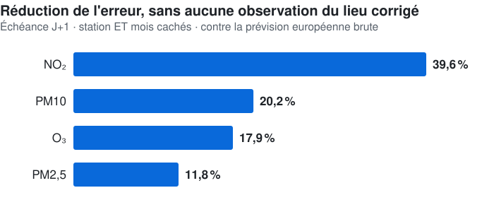
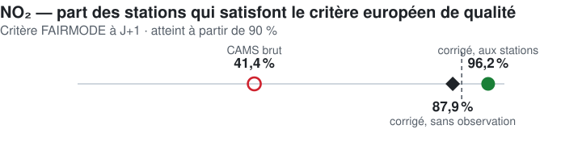

<div align="center">

# 🚀 Cyril BOURGEOIS

### Data Scientist | MLOps Engineer | Problem Solver

[](https://cyril-bgs-dev-tech.github.io/Portfolio/)


[](https://www.linkedin.com/in/cyril-bourgeois/)
[](mailto:cyril.bgs.dev.tech@gmail.com)
[](https://www.kaggle.com/cyrilbourgeois)

---

</div>

## 🎯 À Propos

> *"Transformer des données complexes en décisions business impactantes"*

Data Scientist passionné avec **double compétence modélisation + production**, spécialisé en détection d'anomalies et systèmes MLOps temps réel. Mon parcours atypique (armée → commerce → data science) m'a apporté une perspective unique : **rigueur technique + sens du business + communication efficace**.

### 🏆 Faits Marquants

<table>
<tr>
<td width="33%" valign="top">
  
**🥇 Kaggle Top 1%**
- 35+ compétitions
- 3 top 1% mondial
- Meilleur rang : #14/3022

</td>
<td width="33%" valign="top">
  
**🔬 Benchmarks SOTA**
- ADBench : 47 datasets
- TSB-AD : 870 séries U + 200 M
- Reproductions exactes validées

</td>
<td width="33%" valign="top">
  
**⚙️ MLOps Temps Réel**
- DAG 9 workers, 4 réplicas
- Dashboard 40+ pages RASCI
- Observabilité Prometheus/Grafana

</td>
</tr>
</table>

---

## 💼 Expérience Professionnelle

<div align="center">

### 🏭 Data Scientist - MICHELIN (Alternance)
*Février 2023 - Février 2024 · 39h/semaine, 4 jours/5 en entreprise*

</div>

**POC Parsing/Matching de Données Complexes — Niveau Continental**

🎯 **Mission** : Réalisation d'un POC de parsing/matching de données complexes, niveau continental

✨ **Réalisations** :
- 🎯 Augmentation considérable du taux de détection des correspondances
- 🧹 Nettoyage et qualité des données, analyses spécifiques autour du pricing niveau mondial
- ✅ Tests de non régression

💡 **Impact** :
- Vitesse d'exécution et résultats jugés excellents d'après plusieurs Product Owners
- Accélération considérable des temps de traitement par rapport au processus manuel
- POC mené jusqu'au bout et préparé pour la mise en production, adapté et utilisé par les équipes par la suite

🗣️ **Feedback** :
> *"Implication et capacité constante à se challenger. Force de proposition, assidu dans les missions. POC parsing/mapping mené avec succès."*  
> — Antoine DANIEL LAMAZIERE (PO) + Architecte Data

---

<div align="center">

### 🧪 Data Scientist / ML Engineer - DELTAMU (CDD)
*Octobre 2024 - Octobre 2025*

</div>

**Recherche en Détection d'Anomalies — Capteurs Industriels (Pharma)**

🎯 **Contexte** : Industrie pharma, plusieurs centaines de capteurs

✨ **Missions** :
- 🔬 Tests de recherche en clustering et détection d'anomalies
- 📊 Analyse et interprétation d'insights et de cycliques
- 🧠 Création d'un algorithme de niveau recherche validé par le responsable scientifique

💡 **Impact** :
- 📈 Analyses statistiques avancées sur ensemble de bon fonctionnement
- ⚡ Cœur calculatoire haute vitesse optimisé en **Rust**
- 🔍 Augmentation colossale de la capacité de compréhension des données

🗣️ **Feedback** :
> *"Réelle passion pour la data science et les algorithmes d'IA. Investissement dans les missions. Contribution active au produit logiciel."*  
> — Nuno DOS REIS, Président, DELTAMU

---

## 🎓 Formation

<div align="center">

| Master 2 - Data Scientist | Master 1 - Data Analyst |
|:---:|:---:|
| **OpenClassrooms + Centrale Supélec** (2024) | **OpenClassrooms + ENSAE** (2022) |
| 7 projets validés | 10 projets validés |
| Alternance Michelin (12 mois) | — |
| Deep Learning, NLP, Time Series | ML classique, SQL, BI |

</div>

---

## 🛠️ Stack Technique

<div align="center">

### 🐍 Langages & Frameworks


### 📊 Machine Learning & IA


### 🤖 LLMs utilisés


### ⚡ Agentic


### ⚙️ MLOps & Infrastructure


### 📈 Visualisation & BI


</div>

---

## 🚀 Projets Phares

### 🌬️ [Correction apprise des prévisions de qualité de l'air](projets_Qualite_Air/)
**Apprendre l'erreur du modèle européen, et la corriger** — 36 mois, 28 M de mesures horaires, 4 polluants

<div align="center">

<picture>
  <source media="(prefers-color-scheme: dark)" srcset="assets/v1_gain_polluants_sombre.svg">
  
</picture>

</div>

✨ **Highlights** :
- 🎯 **Prévoir là où personne ne mesure** : aucune observation du lieu corrigé n'entre dans le modèle — et il est testé sur des stations *et* des mois qu'il n'a jamais vus
- 📅 **En 2030 l'Europe divise ses seuils par deux** : à pollution inchangée, les stations en dépassement passent de **6 à 109** — et 4 départements d'Occitanie n'ont aucune station pour le constater
- ✅ **Utilisable au sens réglementaire&nbsp;?** **Sans aucune observation du point**, la part des stations NO₂ qui satisfait le critère européen passe de 41,4 % à **87,9 %** — encore sous le seuil de 90 %. **Aux stations instrumentées**, elle atteint **96,2 %**


- 🔍 **Les limites sont publiées comme les résultats** : 3 épisodes de pollution réels détectés sur 33 — l'observation directe elle-même n'en attrape que 21, et le produit officiel 1
- 💻 **Code** : [github.com/cyril-bgs-dev-tech/correction-previsions-qualite-air](https://github.com/cyril-bgs-dev-tech/correction-previsions-qualite-air)

<picture>
  <source media="(prefers-color-scheme: dark)" srcset="assets/v3_fairmode_no2_sombre.svg">
  
</picture>

---

### 🔧 [Système MLOps Temps Réel](vigilance/)
**Détection d'anomalies industrielle** - 1 200+ heures

<div align="center">


</div>

✨ **Highlights** :
- 🏗️ DAG event-driven : 9 workers, barrières Redis atomiques, DLQ, reprise après crash
- 🤖 3 canaux décorrélés (IsolationForest + Ridge temporel + PCA séquentiel) fusionnés par XGBoost + détection de nouveauté
- 🎫 Cycle de vie d'alarme en épisode unique : hystérésis, escalade, SLA par sévérité
- 📊 Dashboard Streamlit 40+ pages avec rôles RASCI
- 🔭 Observabilité par étape du DAG : Prometheus + Grafana + cAdvisor
- 💻 **Code** : [github.com/cyril-bgs-dev-tech/vigilance](https://github.com/cyril-bgs-dev-tech/vigilance)

---

### 🕵️ [Aegis-RCA — Agent de Diagnostic de Causes Racines](aegis-rca/)
**Prototype de recherche actif** — extension de vigilance, 3 jours de développement (juillet 2026)

✨ **Highlights** :
- 🤖 Agent LLM local (Qwen3.6:27B) qui investigue les incidents ouverts par vigilance : contexte métriques, RAG sur procédures, diagnostic + recommandation validés par un humain
- 🔬 Décisions d'architecture confrontées à des avis externes (Gemini, ChatGPT) **puis vérifiées par des bancs de mesure réels** — une erreur de méthodologie détectée et corrigée en cours de route, documentée telle quelle
- 🛡️ Sandbox d'auto-correction durci (Docker jetable, réseau isolé, cgroups) — 1 succès réel mesuré
- 💻 **Code** : [github.com/cyril-bgs-dev-tech/aegis-rca](https://github.com/cyril-bgs-dev-tech/aegis-rca)

---

### 🔬 [Recherche Compositionnelle - Anomaly Detection](anomaly_tabular/)
**Composer les SOTA et router par domaine — ADBench (tabulaire) + TSB-AD (séries temporelles)**

<div align="center">


-%231%20des%202%20volets%20TSB--AD-10B981?style=for-the-badge)


</div>

✨ **Highlights** :
- 🎯 Démarche : reproduire l'ancre (égalités exactes : Sub-PCA 0.4234, Sub-KNN 0.3501) → monter les SOTA → **caractériser les domaines** → router
- 🥇 PaAno (ICLR 2026) intégré à TSB-AD et certifié : **#1 des volets U et M** (0.58 / 0.46 VUS-PR vs 0.42 / 0.31 pour les leaders publiés)
- 📈 Tabulaire : **routeur source-strict 72,8 AUROC** (pré-enregistré, LODO groupé par source) contre **69,8** pour le meilleur détecteur unique — soit **+3,0 points** ; oracle du corpus à **78,7**
- 💡 Leçon : même avec un système SOTA, la composition par domaine ajoute jusqu'à +0.33 VUS-PR localement
- 🔬 Volets : [tabulaire](anomaly_tabular/) · [séries temporelles](anomaly_tsad/) — dépôts : [anomaly_tabular](https://github.com/cyril-bgs-dev-tech/anomaly_tabular) · [anomaly_tsad](https://github.com/cyril-bgs-dev-tech/anomaly_tsad)

---

### 🏆 [Compétitions Kaggle - Top 1% Mondial](projets_Competitions/)
**35+ compétitions** | **3 top 1%**

<div align="center">

| Compétition | Rang | Top % |
|:---|:---:|:---:|
| 🏎️ Prediction F1 Pit Stop | #14 / 3 022 | 0.5% |
| 🌾 Predicting Irrigation Need | #32 / 4 315 | 0.7% |
| 🎧 Predict Podcast Listening | #20 / 3 310 | 0.6% |
| 🏠 Regression California Housing | #14 / 689 | 2% |

</div>

✨ **Approche** :
- 🔧 Feature engineering intensif (centaines de features)
- 🤝 Ensembling/stacking de modèles diversifiés
- ⚡ Optimisation bayésienne (Optuna)
- 🔬 Veille active (TabM, TabICL2, RealMLP)
- 🤖 La stratégie gagnante se déplace vers l'**agentique** — des systèmes d'agents qui explorent et sélectionnent les pistes en autonomie
- 🏅 **Palmarès vérifiable** : [kaggle.com/cyrilbourgeois](https://www.kaggle.com/cyrilbourgeois/competitions)

---

## 📂 Structure du Portfolio

<div align="center">

```
📦 Portfolio
├── 🎓 projets_Master_1/  # 10 projets Data Analyst
├── 🎓 projets_Master_2/  # 7 projets Data Scientist + Michelin
├── 🏆 projets_Competitions/  # 35+ compétitions Kaggle
├── 🌬️ projets_Qualite_Air/  # Correction apprise des prévisions CAMS
├── 🔧 vigilance/  # Système MLOps temps réel
├── 🕵️ aegis-rca/  # Agent de diagnostic de causes racines
├── 🔬 anomaly_tabular/  # Recherche tabulaire
└── 🔬 anomaly_tsad/  # Recherche time series
```

</div>

---

## 🎯 Ce Que Je Recherche

<div align="center">

### 🚀 Opportunités

</div>

- **Data Scientist** : Projets ML/DL complexes, détection d'anomalies
- **MLOps Engineer** : Mise en production de modèles, systèmes temps réel
- **Research Engineer** : État de l'art, benchmark, nouvelles architectures

### 🌟 Environnement Idéal

- ✅ Équipe technique passionnée et collaborative
- ✅ Problématiques business à fort impact
- ✅ Stack moderne (Python, cloud, MLOps)
- ✅ Culture data-driven et innovation

---

## 📫 Contact

<div align="center">

**📧 Email** : [cyril.bgs.dev.tech@gmail.com](mailto:cyril.bgs.dev.tech@gmail.com)  
**💼 LinkedIn** : [linkedin.com/in/cyril-bourgeois](https://www.linkedin.com/in/cyril-bourgeois/)  
**🏆 Kaggle** : [kaggle.com/cyrilbourgeois](https://www.kaggle.com/cyrilbourgeois)  
**🐙 GitHub** : [github.com/cyril-bgs-dev-tech](https://github.com/cyril-bgs-dev-tech)

</div>

---

<div align="center">

### 🌟 *"Le code ne ment jamais, les commentaires oui"* - Linus Torvalds

*Portfolio construit avec passion | Quarto + GitHub Pages*


*Dernière mise à jour : Août 2026*

</div>
