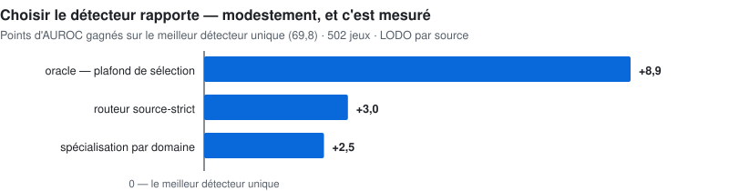

# 🔬 Recherche Compositionnelle — Détection d'Anomalies Tabulaire

**Thèse** : aucun détecteur d'anomalies ne domine partout. Plutôt que de chercher un modèle miracle, on **compose** les meilleurs détecteurs (SOTA inclus) et on apprend **quand utiliser lequel** — en caractérisant les domaines de données. La performance vient de la sélection, pas d'un énième détecteur.

**Où en est ce projet** :
- ✅ Fait : 5 détecteurs de référence reproduits sur 47 datasets (ADBench), corpus étendu à 502 datasets / 19 domaines, système de sélection par domaine validé en LODO préenregistré (+3.0 pts vs meilleur détecteur unique) — résultats bruts par dataset publiés (502 lignes)
- 🚧 Pas encore fait : le harnais de calcul complet n'est pas encore extrait dans ce dépôt public sous une forme ré-exécutable par un tiers — la méthodologie, les résultats consolidés et les données brutes y sont, pas encore le code

**📊 [Présentation interactive](https://cyril-bgs-dev-tech.github.io/anomaly_tabular/)** — résultats par domaine, tous les constats (y compris les négatifs), enseignements.

---

## 🧑‍💼 Vue d'ensemble

**La question posée** : pour détecter des anomalies dans des données tabulaires (transactions, mesures, dossiers...), existe-t-il un détecteur qui marche mieux que tous les autres, quel que soit le domaine ? Beaucoup de projets s'arrêtent au premier modèle qui bat une baseline.

**Ce qu'on a trouvé** : le détecteur qui gagne change selon le domaine — un modèle par diffusion domine sur des données d'activité, un modèle causal sur des données agricoles, un autre sur de l'audio. Plutôt que de chercher LE détecteur universel, la solution est de **reconnaître le domaine** et d'y assigner le détecteur qui y excelle réellement.

**Pourquoi c'est rigoureux et pas juste une intuition** : avant de prétendre faire mieux que les résultats publiés dans la recherche académique (ADBench, la référence du domaine), la première étape a été de **reproduire exactement** ces résultats — c'est la garantie que les comparaisons qui suivent sont fiables et pas un artefact de mesure.

**Le résultat chiffré** : le routeur source-strict gagne +1,48 point sur l'ensemble fixe de 18 détecteurs, sous le même protocole (LODO groupé par source) — la comparaison à un détecteur unique relève d'un autre régime d'évaluation et n'est pas reprise ici. Il dépasse le meilleur détecteur unique de +3.0 points de précision (AUROC) — un gain confirmé statistiquement (pas un hasard de mesure) et vérifié sur des données jamais vues pendant la mise au point.

**Une découverte utile en soi** : sur environ un tiers des jeux de données (les cas "mal posés", où même les méthodes classiques peinent), ce sont les modèles de dernière génération ("foundation models") qui prennent le relais — alors qu'ils sont plutôt décevants en moyenne. Savoir *quand* changer d'outil est aussi précieux que l'outil lui-même.

**Ce que ça démontre** : la capacité à mener une recherche appliquée avec la même rigueur qu'une publication scientifique (hypothèses figées avant les résultats, vérification systématique), tout en restant honnête sur les limites (le gain est nul sur certains domaines, et c'est dit clairement).

<picture>
  <source media="(prefers-color-scheme: dark)" srcset="../assets/v7_routeur_tabulaire_sombre.svg">
  
</picture>

<strong>🔧 Détails techniques</strong> — cliquer pour déplier

## 1️⃣ Le benchmark de base (l'ancre)

**ADBench** — la référence académique du domaine : 47 datasets tabulaires classiques, protocoles et hyperparamètres officiels (dépôts de référence clonés, pas réinventés).

## 2️⃣ Reproduction — le harnais doit être exact avant tout

Reproduction des détecteurs de référence avec un harnais maison (pool de processus ~28 workers, 1 thread BLAS/worker, cache reprenable — un crash ne perd aucun calcul) :

| Détecteur | Score reproduit (protocole ADBench, 47 datasets) |
|-----------|-----------------|
| IsolationForest | 0.762 |
| COPOD | 0.744 |
| ECOD | 0.742 |
| PCA | 0.740 |
| KNN | 0.699 |

Chaque écart au publié passe par une checklist : métrique, splits/seeds, hyperparamètres, préprocessing, version des données, variance, librairies.

## 3️⃣ Nos modèles sur le même banc d'essai

- **Champion maison (famille MRCD, covariance robuste)** — évalué en **préenregistrement** (hypothèses figées avant les runs) : **+1.5 pt d'AUROC médian vs IsolationForest** (p = 1.3×10⁻⁵ sur 92 datasets à anomalies natives), généralisation confirmée **hors échantillon** (+3.1 pts sur 74 datasets jamais vus). Lecture honnête, publiée telle quelle : effet réel mais modeste, nul face à KNN — ce filon seul ne suffit pas.
- **Pool de 18 « rails »** : détecteurs spécialisés par mécanisme (distance, densité, reconstruction, spectral, diffusion, covariance robuste…) + 2 **foundation models** tabulaires (TabICL, TabPFN), tous évalués au même protocole.

## 4️⃣ Spécialiser le benchmark : caractérisation des domaines

Extension du corpus à **502 datasets / 19 domaines applicatifs** (médical, vision, pharma, finance, réseau, génomique, industrie, audio…), avec méta-features label-free par dataset. Deux découvertes structurantes :

- **Le champion change selon le domaine** : diffusion #1 en activité, modèle causal non-linéaire #1 en agriculture, entropie spectrale #1 en audio… Le « meilleur détecteur global » n'est le meilleur presque nulle part.
- **Découverte des régimes** : 168/502 datasets sont « mal posés » (IF-AUC < 0.55). Sur ce régime, les **foundation models dominent** tous les détecteurs classiques — alors qu'ils sont médiocres en moyenne globale. Le signal de routage existe.

## 5️⃣ L'extension par domaines — et les scores

Système **tuned-domaine** : configuration du pool figée par domaine, validée en **LODO préenregistré** (leave-one-dataset-out) :

| Système | AUROC moyen | Lecture |
|---|---:|---|
| IsolationForest (baseline) | 63.8 | largement dépassée |
| KNN (meilleur détecteur unique) | 69.8 | le « SOTA single » |
| Ensemble 18 rails (fusion plate) | 71.3 | déjà mieux que tout single |
| **Routeur source-strict (préenregistré, LODO groupé par source)** | **72.8** | bat KNN de +3.0 pts — headline |
| Oracle du pool (sélection parfaite) | 78.7 | le plafond à capturer |

Gains par domaine du routage : **+5.1 pts environnement, +3.3 agriculture, +3.0 réseau** — et honnêtement 0.0 sur médical/finance (domaines où le signal de routage reste à trouver).

## 💡 Aparté — combien gagne-t-on au-dessus d'un système SOTA ?

Même en partant du **meilleur détecteur unique** (KNN, 69.8), la composition rapporte **+3.0 pts** aujourd'hui — et le plafond de sélection parfaite est à **+8.9 pts** (oracle 78.7). Autrement dit : ~70 % du gain accessible n'est **pas encore capturé**, et il se trouve dans la sélection, pas dans un 19ᵉ détecteur (démontré par screening systématique : les candidats supplémentaires n'élèvent plus l'oracle).

## 🧭 Prochaines actions intelligentes

1. **Méta-routeur par dataset** (au-delà du domaine) : kNN-sélecteur puis LightGBM en ranking des rails, méta-features label-free uniquement, validation LODO **nichée** — objectif : battre 72.8
2. **Proxy label-free du régime « mal posé »** (critère : corrélation > 0.5) → routage ciblé des foundation models
3. **Fusion pondérée par point** plutôt que sélection dure par dataset (la pondération douce bat déjà la fusion plate de +0.9)
4. **Corpus : grandir en natif** (~200 datasets à anomalies réelles) + lot de réplication séquestré
5. **Baseline concurrente MetaOD** re-run au même protocole + courbe de scaling du routeur (100 → 250 → 502 datasets) — les conditions de publiabilité

---

**Dépôt dédié** : [github.com/cyril-bgs-dev-tech/anomaly_tabular](https://github.com/cyril-bgs-dev-tech/anomaly_tabular)  
**Projet frère** : [Recherche time series](../anomaly_tsad/) (TSB-AD, PaAno, routage par domaine)  
**Dernière mise à jour** : Août 2026  
**Contact** : cyril.bgs.dev.tech@gmail.com

