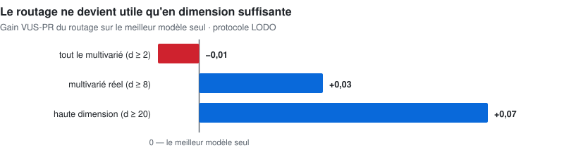

# 🔬 Recherche Compositionnelle — Détection d'Anomalies Séries Temporelles

**Thèse** : même le meilleur modèle SOTA ne domine pas partout sur les séries temporelles. On reproduit le benchmark de référence, on y monte les SOTA les plus récents, puis on **caractérise les domaines** pour router le bon détecteur vers la bonne série — et on mesure ce que cette composition rapporte **au-dessus** du SOTA.

**Où en est ce projet** :
- ✅ Fait : benchmark de référence reproduit à l'exact, dernier état de l'art (PaAno, ICLR 2026) intégré et certifié #1, caractérisation des domaines et gains de routage mesurés en LODO préenregistré
- 🚧 Pas encore fait : le harnais de code n'est pas encore extrait dans ce dépôt public sous une forme reproductible par un tiers — seuls la méthodologie et les classements consolidés y sont aujourd'hui

**📊 [Présentation interactive](https://cyril-bgs-dev-tech.github.io/anomaly_tsad/)** — classements complets, tous les constats, enseignements.

---

## 🧑‍💼 Vue d'ensemble

**La question posée** : face à un signal (température, vibration, trafic réseau...) qui part en dérive, existe-t-il UN modèle qui détecte le mieux les anomalies, quel que soit le type de données ? Beaucoup de recherches cherchent "le" meilleur modèle universel.

**Ce qu'on a trouvé** : non, ce modèle universel n'existe pas. Le meilleur détecteur pour des données médicales n'est pas le même que pour des données de serveurs informatiques ou de capteurs industriels. Plutôt que de chercher LE modèle miracle, l'approche ici est de **reconnaître automatiquement le type de données** et d'assigner le bon outil au bon problème — comme un chef d'orchestre qui assigne le bon musicien à la bonne partition plutôt que de chercher un instrument qui joue tout parfaitement.

**Pourquoi c'est rigoureux et pas juste une intuition** : avant de prétendre faire mieux que les modèles publiés dans la recherche académique, la première étape a été de **reproduire exactement** leurs résultats publiés — sans ça, impossible de savoir si un gain mesuré ensuite est réel ou un artefact de mesure. Cette étape de vérification est ce qui distingue une démarche scientifique sérieuse d'un simple benchmark marketing.

**Le résultat chiffré** : sur **l'ensemble** du multivarié, le routage **ne bat pas** le meilleur modèle seul — **−0,01** de VUS-PR. Il devient positif sur le multivarié réel : **+0,03** à partir de 8 variables, **+0,07** à partir de 20. Les séries quasi-univariées (d = 2) diluent le signal. **Le routage compositionnel est une stratégie du multivarié réel — et le dire est le résultat, pas une réserve.**

**Ce que ça démontre** : la capacité à mener une recherche appliquée avec la même rigueur qu'une publication scientifique (protocoles figés à l'avance, vérifications anti-triche), tout en gardant un œil sur l'utilité pratique du résultat.

## 1️⃣ Le benchmark de base (l'ancre)

**TSB-AD** — 870 séries univariées + 200 multivariées, issues de sources réelles (aérospatial, SCADA industriel, serveurs IT, médical, éolien…).

**Rigueur assumée** : **VUS-PR** en métrique primaire, le **point-adjust est banni** (il gonfle artificiellement les scores — biais documenté), endpoint d'évaluation natif du benchmark, validation LODO par **source** de données (jamais par série : pas de fuite).

## 2️⃣ Reproduction — des égalités exactes au publié

| Détecteur | Publié (VUS-PR moyen) | Reproduit | Statut |
|-----------|--------|-----------|--------|
| Sub-PCA (U, 350 séries) | 0.4234 | 0.4234 | ✅ **exact** |
| Sub-KNN (U) | 0.3501 | 0.3501 | ✅ **exact** |
| POLY (U) | 0.3898 | 0.3899 | ✅ |
| CNN (M, 180 séries) | 0.313 | 0.3171 | ✅ écart diagnostiqué |

SOTA récents montés et validés sur RTX 5090 : MOMENT (foundation, zero-shot), TranAD, AnomalyTransformer, FITS, Donut, OFA — plus les blocages documentés (Chronos/TimesFM : environnements isolés ; TimesNet : kernel CUDA incompatible Blackwell).

## 3️⃣ Le SOTA le plus récent sur le même banc : PaAno devient #1

**PaAno** (ICLR 2026, représentation par patchs) n'était pas classé sur TSB-AD. On l'a intégré au protocole officiel, **certifié en pleine résolution** (reproduction conforme au papier : 0.412 vs 0.426 publié sur Eva-M), puis classé contre tout le leaderboard :

| Volet | PaAno | Leader publié précédent | Rang |
|-------|-------|------------------------|------|
| Univarié (350 séries, 33 méthodes) | **0.58** VUS-PR moyen | Sub-PCA 0.42 | 🥇 #1 (rang moyen 7.8 vs 12.6 au suivant) |
| Multivarié (180 séries, 24 méthodes) | **0.46** VUS-PR moyen | CNN 0.31 | 🥇 #1 (rang moyen 7.3) |

Un écart pareil vs le publié impose la paranoïa méthodologique : mêmes splits Eva, protocole officiel, runs pleine longueur sur les séries > 250k points, vérification anti-fuite — d'où la certification avant tout claim.

## 4️⃣ Spécialiser le benchmark : caractérisation des domaines

Le corpus multivarié est caractérisé en **10 domaines applicatifs** (aérospatial, SCADA industriel, serveurs/ITops, éolien-solaire, médical cardiaque, médical neuro, robotique/drones, finance, wearables, eau/environnement) + méta-features par série (dimension, périodicité, non-stationnarité, corrélation inter-canaux…).

**Constat clé** : le champion varie par domaine — PaAno domine en robotique/finance/wearables, mais la **covariance robuste (Mahalanobis)** gagne en SCADA, le **spectral** en serveurs ITops et médical neuro, la **dynamique de corrélation** en eau/environnement.

## 5️⃣ L'extension par domaines — et les scores

Routage tuned-domaine validé en LODO, gains **au-dessus du meilleur global** par domaine :

| Domaine | Gain LODO (VUS-PR) | Rail gagnant |
|---------|-------------------:|--------------|
| Serveurs / ITops | **+0.33** | spectral |
| Médical cardiaque | **+0.27** | champion covariance |
| Médical neuro | **+0.11** | Mahalanobis |
| Éolien-solaire | +0.01 | Mahalanobis |

Et le signal le plus intéressant — **le gain du routage croît avec la dimensionnalité** :

<picture>
  <source media="(prefers-color-scheme: dark)" srcset="../assets/v8_routage_dimension_sombre.svg">
  
</picture>

Les séries quasi-univariées (d = 2) diluent le signal : le routage compositionnel est une stratégie **du multivarié réel**.

## 💡 Aparté — combien gagne-t-on au-dessus d'un système SOTA ?

Même en déployant PaAno partout (le #1 absolu), la spécialisation par domaine ajoute jusqu'à **+0.33 de VUS-PR** localement, et l'oracle du pool laisse **+0.16 à +0.24** de marge selon la dimension. Le SOTA global est un excellent défaut — pas une stratégie optimale : sur les benchmarks hétérogènes, **la composition bat le champion**.

## 🧭 Prochaines actions intelligentes

1. **Benchmark & routeur « multivarié pur »** (d ≥ 8) — là où le signal de routage est démontré
2. **Proxy label-free de difficulté** par série (le routage ne doit dépendre d'aucun label)
3. **Warm-start par source** : les deltas warm vs cold montrent qu'un historique de la source vaut des points (jusqu'à +0.44 en médical neuro)
4. **Corpus qualité** : ≥ 800 séries / ≥ 12 domaines avec gates de qualité par série
5. **Préenregistrement + réplication séquestrée** des claims de routage (même discipline que le volet tabulaire)

---

**Dépôt dédié** : [github.com/cyril-bgs-dev-tech/anomaly_tsad](https://github.com/cyril-bgs-dev-tech/anomaly_tsad) (classements complets inclus)  
**Projet frère** : [Recherche tabulaire](../anomaly_tabular/) (ADBench, 502 datasets, 19 domaines)  
**Dernière mise à jour** : Août 2026  
**Contact** : cyril.bgs.dev@gmail.com
