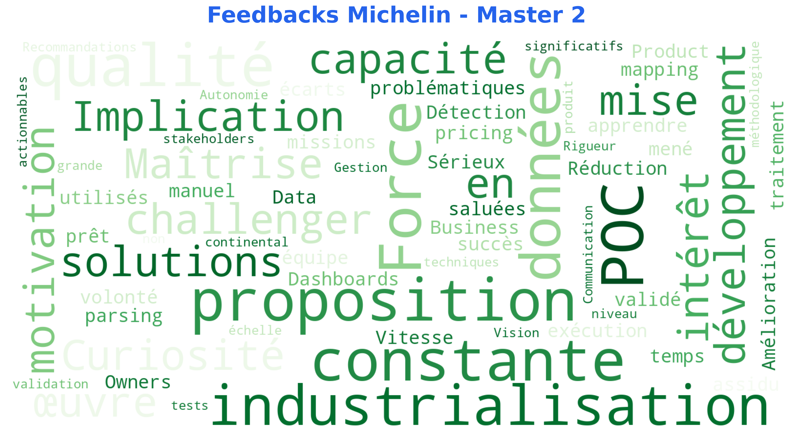

# 🎓 Projets Master 2 - Data Scientist (2023-2024)

**Formation** : OpenClassRooms + Centrale Supelec  
**Alternance** : MICHELIN (Fév 2023 - Fév 2024)  
**Durée** : 12 mois

---

## 🏭 Alternance Michelin - POC Parsing/Matching de Données Complexes

**Statut** : ✅ Validé - Alternance réussie  
**Durée** : 12 mois (Fév 2023 - Fév 2024)  
**Contexte** : Données pricing mondial, niveau continental, hétérogénéité des sources

### Problématique
- Matcher des données provenant de sources multiples avec des formats différents
- Assurer la qualité des données pour des analyses pricing fiables
- Industrialiser un POC pour une utilisation en production

### Missions Réalisées

#### 1. Parsing et Extraction
- Extraction de données structurées et non structurées
- Normalisation des formats (dates, devises, unités)
- Gestion des doublons et conflits
- Parsing de fichiers JSON, XML, CSV, Excel

**Technologies** : Python (Pandas, Regex), JSON/XML parsing

#### 2. Matching et Réconciliation
- Algorithmes de fuzzy matching
- Règles de business pour validation
- Score de confiance pour chaque match
- Gestion des cas limites

**Technologies** : Scikit-learn, Distance de Levenshtein, TF-IDF

**Résultat** : Score de confiance > 85% sur dataset de test

#### 3. Contrôle Qualité
- Tests de non-régression automatisés (PyTest)
- Détection d'anomalies dans les données
- Alertes sur incohérences
- Validation croisée des résultats

#### 4. Analyse Pricing Mondial
- Dashboards interactifs par région/produit/période
- Détection d'écarts de pricing
- Recommandations pour l'équipe métier

**Technologies** : Power BI, Streamlit, Plotly

### Résultats Globaux
- POC validé et prêt pour industrialisation
- Réduction du temps de traitement manuel
- Amélioration de la qualité des données
- Dashboards utilisés par l'équipe pricing

### Synthèse des Feedbacks

**Mots-clés dominants** :
- **Implication/Challenger** : Engagement constant
- **Maîtrise/Développement** : Compétences techniques solides
- **Force proposition** : Autonomie et initiative
- **Qualité/Exécution** : Standards élevés
- **Industrialisation** : Vision produit

### Feedback Michelin
**Antoine DANIEL LAMAZIERE (PO) + Architecte Data** :
- *"Implication et capacité constante à se challenger"*
- *"Maîtrise des solutions de développement et mise en œuvre"*
- *"Force de proposition, assidu dans les missions"*
- *"POC parsing/mapping mené avec succès"*

---

## 🧠 Projets Académiques

### Projet 1 : Définissez Votre Stratégie d'Apprentissage
**Statut** : ✅ Validé

**Objectifs** :
- Définir une stratégie d'apprentissage personnalisée
- Planifier le parcours Master 2
- Identifier les ressources et outils

---

### Projet 2 : Concevez une Application au Service de la Santé Publique
**Statut** : ✅ Validé

**Contexte** : Application data science pour la santé publique

**Réalisation** :
- Analyse de données de santé
- Modélisation prédictive
- Visualisation et recommandations

---

### Projet 3 : Anticipez les Besoins en Consommation de Bâtiments
**Statut** : ✅ Validé

**Contexte** : Prédiction de consommation énergétique

**Réalisation** :
- Feature engineering temporel
- Modèles de régression
- Prévisions de consommation

---

### Projet 4 : Segmentez des Clients d'un Site E-commerce
**Statut** : ✅ Validé

**Contexte** : Segmentation client pour e-commerce

**Réalisation** :
- Clustering (K-Means, CAH)
- Analyse comportementale
- Recommandations business

---

### Projet 5 : Catégorisez Automatiquement des Questions
**Statut** : ✅ Validé

**Contexte** : Classification automatique de textes (NLP)

**Réalisation** :
- Pipeline NLP (tokenization, vectorization)
- Modèles de classification de textes
- TF-IDF, embeddings, transformers

---

### Projet 6 : Classez des Images à l'Aide d'Algorithmes de Deep Learning
**Statut** : ✅ Validé

**Objectifs pédagogiques** :
- Maîtriser les architectures CNN (Convolutional Neural Networks)
- Transfer learning avec modèles pré-entraînés
- Data augmentation et régularisation

**Réalisation** :
- Architectures testées : CNN custom, ResNet, VGG, EfficientNet
- Framework : TensorFlow/Keras ou PyTorch
- Prétraitement d'images (normalisation, redimensionnement)
- Data augmentation (rotation, flip, zoom)
- Transfer learning et fine-tuning
- Gestion du surapprentissage (dropout, batch normalization)

**Technologies** : Python, TensorFlow/PyTorch, CNN, Transfer Learning

---

### Projet 7 : Développez une Preuve de Concept (Option Stage)
**Statut** : ✅ Validé

**Contexte** : POC pour validation des acquis avant stage/alternance

**Réalisation** :
- Projet intégrateur combinant plusieurs compétences
- Démonstration de capacité à mener un projet de bout en bout
- Présentation et soutenance

---

## 🎯 Compétences Acquises en Master 2

### Deep Learning
- ✅ CNN, RNN, Transformers
- ✅ Transfer learning et fine-tuning
- ✅ Data augmentation avancée

### NLP
- ✅ Fine-tuning LLMs (BERT, CamemBERT)
- ✅ Word embeddings
- ✅ Pipeline NLP complet

### Time Series
- ✅ Feature engineering temporel avancé
- ✅ Modèles statistiques et deep learning
- ✅ Validation spécifique séries temporelles

### Détection d'Anomalies
- ✅ Approches statistiques et ML
- ✅ Autoencoders
- ✅ Gestion du déséquilibre

### Entreprise
- ✅ Gestion de projets data (Michelin, 12 mois)
- ✅ Collaboration avec Product Owners et Architectes Data
- ✅ Vision produit et industrialisation
- ✅ Communication avec stakeholders non-techniques

---

## 🛠️ Stack Technique Master 2

| Catégorie | Technologies |
|-----------|-------------|
| **Deep Learning** | PyTorch, TensorFlow, Keras |
| **NLP** | HuggingFace Transformers, SpaCy, NLTK |
| **Time Series** | Statsmodels, Prophet, LSTM |
| **Anomalies** | Scikit-learn, Isolation Forest, Autoencoders |
| **Entreprise** | Power BI, Streamlit, Plotly, Git |
| **Testing** | PyTest |

---

**Dernière mise à jour** : Juillet 2026  
**Contact** : cyril.bgs.dev.tech@gmail.com

> 📦 **Livrables complets** (notebooks, rapports, soutenances) disponibles sur demande — non versionnés ici pour garder le dépôt léger.
