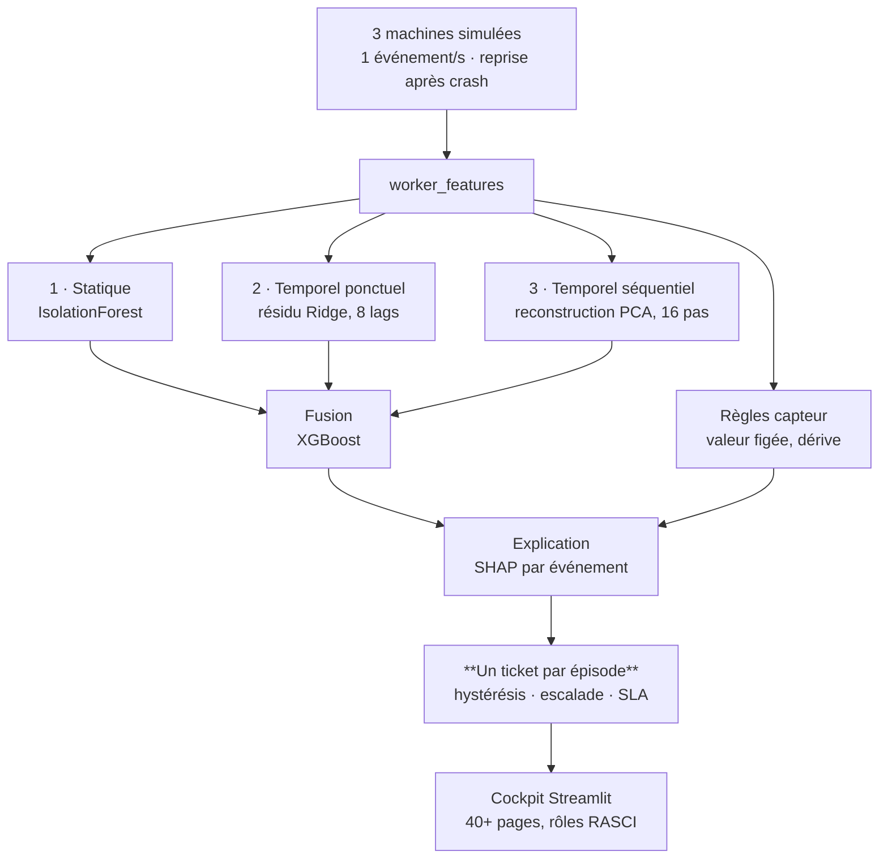

# 🔧 Vigilance — Détection d'Anomalies Temps Réel (MLOps)

**Vision** : plateforme complète de détection d'anomalies en temps réel, démontrant une maîtrise bout-en-bout du MLOps — de la modélisation à la mise en production, avec observabilité et gestion du cycle de vie des alarmes.

**Contexte** : projet personnel, conçu comme un système (event model, workers découplés, registries versionnés) et non comme une suite de scripts  
**Durée** : 1 200+ heures de développement (2025-2026)  
**Périmètre** : 3 machines simulées (capteurs numériques, flux 1 event/s/machine), extensible par simple enregistrement de dataset

**Où en est ce projet** :
- ✅ Fait et fonctionnel : pipeline de détection (3 canaux + fusion), cycle de vie d'alarme, dashboard 40+ pages, observabilité Prometheus/Grafana, résilience (DLQ, backups, reprise après crash)
- 🚧 Prévu, pas encore construit : boucle de feedback opérateur (validation humaine → réentraînement automatique), score de santé agrégé par machine
- 🔭 Exploratoire : GATv2/Transformer sur graphes de capteurs (prototype existant, pas intégré au pipeline)

---

## 🧑‍💼 Vue d'ensemble

**En une phrase** : un système qui surveille en continu des capteurs industriels et prévient automatiquement quand quelque chose d'anormal se produit — avant que ça ne devienne une panne coûteuse.

**Le problème** : sur une ligne de production, un capteur qui dérive lentement (roulement qui s'use, capteur qui se désétalonne) passe souvent inaperçu jusqu'à la panne. Détecter ce genre de signal faible, en continu et sans intervention humaine, est la promesse du "monitoring intelligent" — le même principe que les outils de supervision utilisés par Netflix ou Uber pour surveiller leurs services, appliqué ici à des capteurs physiques.

**Ce que le système fait concrètement** :
- Il regarde chaque capteur en continu et compare son comportement à trois façons différentes de définir "anormal" (pour ne pas rater un type de dérive qu'une seule méthode manquerait)
- Quand une anomalie est confirmée, il ouvre un ticket unique (pas un spam d'alertes répétées pour le même problème) et lui donne un niveau de gravité
- Un tableau de bord affiche en direct l'état de toutes les machines, avec une explication de *pourquoi* chaque alerte a été levée — pas juste "anomalie détectée", mais "ce facteur précis est responsable"
- Le système sait aussi surveiller sa propre santé : temps de réponse, erreurs, charge — comme le ferait une équipe SRE pour un site web

**Pourquoi c'est difficile** : le vrai défi n'est pas de détecter une anomalie évidente, mais d'éviter à la fois les fausses alertes (qui usent la confiance des opérateurs) et les anomalies manquées — tout en restant utilisable en continu, sans surveillance humaine constante.

**Ce que ça démontre** : la capacité à concevoir un système complet — pas juste un modèle qui prédit, mais tout ce qu'il faut autour pour que ce modèle soit fiable, observable et utilisable en production.

## De trois signaux à un ticket unique



**En clair, sans le schéma** : trois machines simulées émettent un événement par seconde, avec reprise après coupure. Quatre détecteurs les jugent en parallèle — un statique (IsolationForest), deux temporels (résidu Ridge sur 8 retards, reconstruction PCA sur 16 pas) et un jeu de règles capteur. **Seuls les trois premiers sont fusionnés** par XGBoost ; les règles capteur rejoignent directement l'explication SHAP. Le tout est regroupé en **un ticket par épisode** — hystérésis, escalade, SLA — que le cockpit Streamlit présente selon les rôles RASCI.

**Ce que ce flux montre, et qu'une liste de workers ne montre pas** : trois détections
parallèles et décorrélées ne produisent pas trois alertes, mais **un seul incident**, expliqué
et suivi jusqu'à sa clôture. C'est la différence entre un détecteur et un système.

<details>
<summary><strong>L'implémentation, pour qui veut vérifier</strong></summary>

Neuf workers, barrières Redis atomiques (à 3 puis à 2), file de rejet, reprise après crash sur
index persisté. Les canaux `unsup_stat`, `unsup_temp_point`, `unsup_temp_seq` et
`sensor_fault` alimentent `worker_sup`, puis `worker_model_interpreter`,
`worker_correlation_drift` et `worker_novelty_rules_unsup_sup`. Diffusion au cockpit par liste
Redis et Pub/Sub.

</details>

## ⚙️ Exécution distribuée

| Composant | Réalité technique |
|-----------|-------------------|
| **Pool CPU** | 3 réplicas de workers universels (consomment toutes les queues `queue:cpu:*`) |
| **Pool GPU** | 1 worker CUDA 12.8 (queues `queue:gpu:*`) |
| **Synchronisation** | Queues Redis par étape, barrières multi-parents, fusion des prédictions |
| **Résilience** | Dead Letter Queue rejouée (30 s), archiveur Parquet (300 s), backup des registries (1 h, 24 rétentions) |
| **Registries** | JSON versionnés (modèles, features, seuils, alertes, drift, data_versions) — écriture atomique write-tmp → `os.replace` |

### Détecteurs (3 canaux réellement décorrélés)

| Canal | Algorithme | Coût d'inférence |
|-------|-----------|------------------|
| Statique | IsolationForest | ~1 ms/event |
| Temporel ponctuel | Résidu de prévision Ridge sur 8 lags | 0.05 ms/event |
| Temporel séquentiel | Reconstruction PCA sur fenêtres de 16 pas | 0.12 ms/event |

Historique par machine **partagé entre réplicas** via Redis (1 aller-retour par event), calibration sigmoïde alignée (p97 train → proba 0.5), warm-up dégradé propre.

---

## 🎫 Cycle de vie d'alarme — un épisode = un ticket

Machine à états côté backend (pas dans l'UI) :

```
IDLE ──(N ticks anormaux consécutifs)──► OPEN (1 ticket)
OPEN ──(ticks anormaux)──► même ticket : occurrences++, pic, escalade de sévérité
OPEN ──(hystérésis : N ticks normaux consécutifs)──► AUTO_RESOLVED
```

- Un tick normal isolé ne fragmente pas l'épisode (anti-scintillement)
- Concurrence des 3 réplicas gérée **sans verrou** : `SET NX` à l'ouverture, `GETDEL` à la clôture → un seul écrivain par transition
- Clôture opérateur avec cooldown anti-réouverture ; champs opérateur (assignation, notes) jamais écrasés par le backend

---

## 📊 Dashboard Streamlit (40+ pages, 7 sections)

Navigation native `st.navigation`, matrice **RASCI par page** (opérateur / analyste / technicien / admin) :

| Section | Contenu |
|---------|---------|
| 📡 Monitoring | Global live, monitoring local, comparaison de flotte, pires instabilités, dérives |
| 🚨 Alertes | Alertes actives (SLA countdown), assignation, escalade, événements similaires passés |
| 🔍 Investigation | Étude d'anomalie, graphe causal, analyse contrastive, décisions modèles, replay |
| ✅ Feedback | Validation d'anomalies, corrections, qualité des labels |
| 📈 Reporting | Statistiques d'anomalies, historique maintenance, rapports planifiés |
| 🔧 Technicien | Contrôle bootstrap, gestion modèles/seuils, workers du DAG, feature sets |
| ⚙️ Admin | Règles d'alertes, santé système, audit log, gestion utilisateurs |

---

## 🔭 Observabilité

- **Prometheus** : latence et erreurs **par étape du DAG** (`worker_step_duration_seconds`, `worker_step_errors_total`), métriques Redis (exporter dédié)
- **Grafana** : dashboards pipeline + infrastructure, embarquables dans le cockpit
- **cAdvisor** : CPU/RAM par conteneur
- **SLA opérationnel** : countdown par sévérité d'alerte, suivi des dépassements dans le cockpit

---

## 🧠 Interprétabilité intégrée au flux

- SHAP calculé **par event** dans le pipeline (worker dédié), facteur principal remonté jusqu'à la carte d'alerte
- Profils de normalité par cluster (z-mean + SHAP) calculés au bootstrap et versionnés au registre
- Corrélations baseline par machine → détection de dérive de corrélation en ligne

---

## 🔄 Bootstrap « Cartographe »

- Entraînement complet d'une machine (5 modèles + profils d'interprétation) : **~1,5 s**
- Skip **par modèle** (fichier présent → chargé pour le vote, absent → ré-entraîné)
- Vote majoritaire 2/3 des canaux non supervisés → clusters → classifieur supervisé → règles de nouveauté

---

## 🛠️ Stack technique réelle

| Catégorie | Technologies |
|-----------|-------------|
| **Langages** | Python 3.11 |
| **Data** | Polars, Pandas, NumPy, Parquet |
| **ML** | Scikit-learn, XGBoost, PyTorch (CUDA 12.8) |
| **Interprétabilité** | SHAP |
| **Infrastructure** | Docker Compose (14 services), Redis 7 |
| **Monitoring** | Prometheus, Grafana, cAdvisor, redis-exporter |
| **Dashboard** | Streamlit ≥ 1.36 (st.navigation) |

---

## 🎯 Compétences démontrées

- **Architecture événementielle** : DAG distribué, barrières atomiques, workers découplés, fusion d'états
- **Fiabilité** : DLQ, archivage, backups, reprise exacte après redémarrage, dégradation propre (warm-up, TTL)
- **Gestion d'alarmes** : machine à états, hystérésis, escalade, déduplication en épisode unique — le cœur métier d'un système de monitoring industriel
- **MLOps** : registries versionnés, bootstrap conditionnel, compatibilité descendante des modèles picklés
- **Observabilité** : métriques par étape, SLA, monitoring infra
- **UX opérationnelle** : 40+ pages organisées par rôle RASCI, du cockpit temps réel à l'audit

---

## 🚀 Évolutions prévues

- **Court terme** : boucle de feedback fermée avec [Aegis-RCA](../aegis-rca/) — les diagnostics de cause racine validés (ou corrigés) par un opérateur deviennent des labels pour réentraîner la couche supervisée au-delà du binaire anomalie/pas-anomalie ; score de santé agrégé par machine, sparkline d'épisode sur les cartes d'alerte, Redis comme source de vérité unique des tickets
- **Moyen terme** : GATv2/Transformer sur graphes de capteurs (prototype existant), online learning, multi-sites
- **Long terme** : RUL (durée de vie restante), maintenance prescriptive

---

**Code source** : dépôt privé, accès sur demande  
**Dernière mise à jour** : Août 2026  
**Contact** : cyril.bgs.dev@gmail.com
